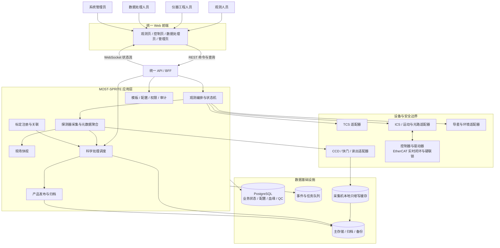
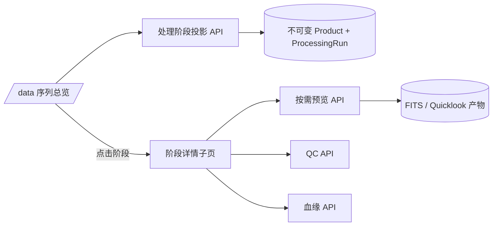
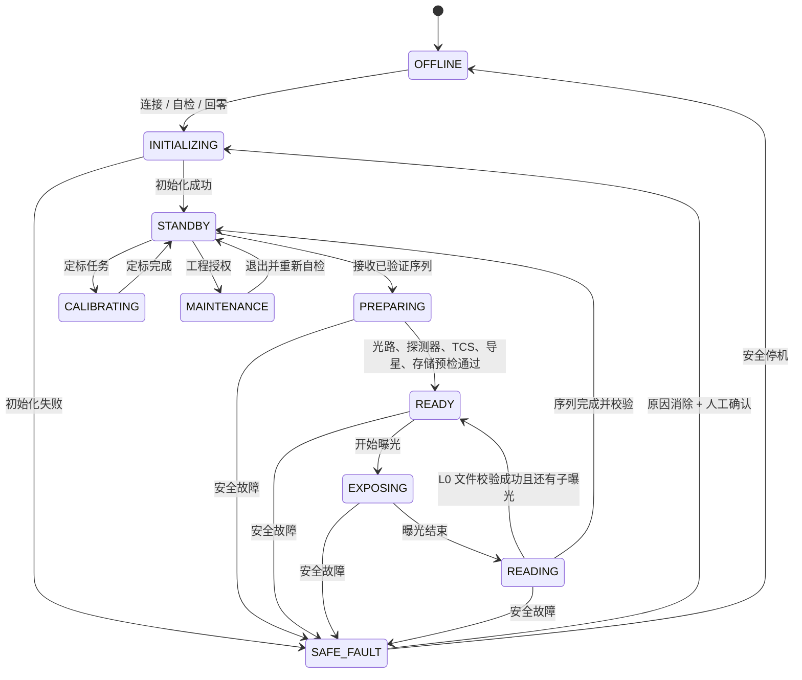
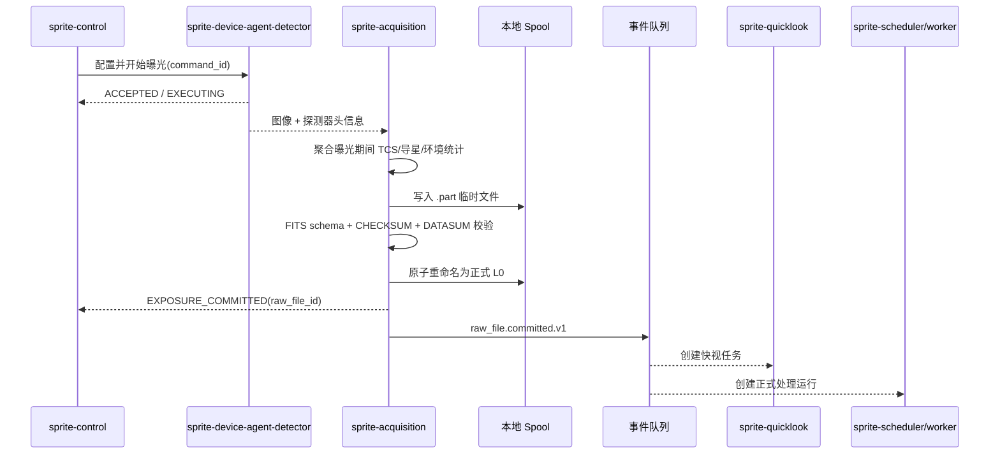
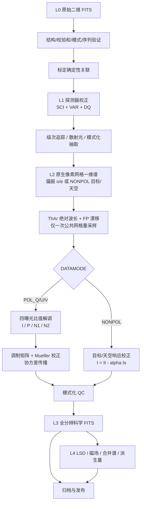
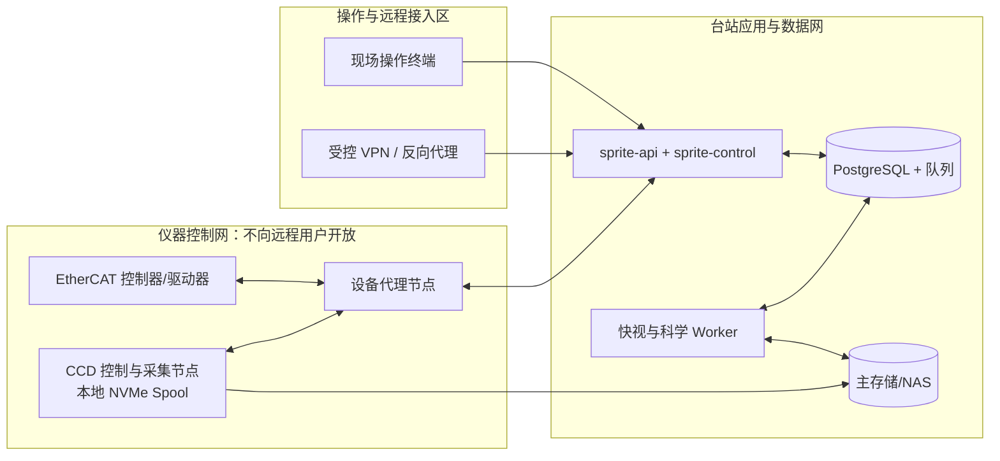

# MOST-SPRITE 全栈偏振光谱管线架构

> 状态：架构基线 v0.4  
> 编制日期：2026-08-26  
> 范围：观测、控制、数据处理前端，以及全部可调用或自动运行的后台服务  
> GAMSE 审计基线：`4d91ead6d8380b75a5a445c2dae78429bc23e0c9`（2026-08-19）

**MOST-SPRITE** 的全称为 **S**pectro**P**olarimetric **R**eduction, **I**nstrument-control, **T**racking & **E**xtraction，中文名称为“MOST 偏振光谱处理、仪器控制、目标跟踪与光谱提取系统”。本文中 **MOST** 指仪器及科学项目，**MOST-SPRITE** 或简称 **SPRITE** 指本软件平台。

命名约定：对外产品名使用 `MOST-SPRITE`，代码仓库使用 `most-sprite`，Python 名字空间使用 `most_sprite`，进程、容器和系统服务使用 `sprite-*` 前缀。

## 1. 架构结论

MOST-SPRITE 不应被实现成“GAMSE 命令行工具外面套一个网页”，而应采用以下结构：

1. **控制面与数据面严格隔离**：控制面负责观测序列、设备状态、安全联锁和采集；数据面负责快视、科学处理、质量控制与归档。数据处理失败不得阻塞硬件安全或当前曝光。
2. **模块化单体代码库、少量独立运行进程**：代码按领域拆分，但首期只部署 API、观测控制、设备代理、采集、快视、处理 Worker、归档等少量进程，避免小团队承担大量微服务运维成本。
3. **GAMSE 作为源码基线而非运行时依赖**：从固定提交中选取阶梯谱公共算法源码，保留来源和许可证后迁入 MOST-SPRITE 代码树并重构为 SPRITE 原生模块；部署时不安装 GAMSE，代码中不 `import gamse`，也不调用其命令行、管线框架或仪器流程。
4. **从观测开始建模偏振科学单元**：`POL_Q`、`POL_U`、`POL_V` 各自以完整四子曝光组为最小科学单元；`NONPOL` 是目标光纤与同期天空光纤构成的独立单曝光分支，不能与偏振分支混用。
5. **L0 永不覆盖，所有结果可重现**：配置、标定、输入校验和、算法参数、软件提交、质量结论和产品血缘全部版本化。
6. **硬实时和安全停机不依赖 Web、数据库或消息队列**：EtherCAT 位置/速度闭环、硬限位和关键联锁保留在控制器/驱动器侧；上层软件只做目标下发、监督、编排和恢复。

## 2. 已知仪器与科学约束

架构以设计报告中的下列约束为基线：

- 波长范围：340–1050 nm，一次曝光全波段覆盖。
- 分辨率：`R >= 77000 @ 1.5"`；阶次约为 57–176。
- 当前光谱仪基线探测器：4K × 4K、15 μm 像元 CCD。
- 观测模式：`POL_Q`、`POL_U`、`POL_V`、`NONPOL`，以及偏置、暗场、平场、ThAr、Fabry–Perot、偏振定标和工程测试。
- 每个 Q/U/V 参量由四子曝光调制组估计；完整 Q/U/V 共十二次子曝光。
- 偏振模式同时记录 o/e 双光束；正式产品必须同时保留科学偏振 P、第一零谱 N1 和第二零谱 N2。
- NONPOL 使用一根目标光纤和第三根天空背景光纤，另一根目标光纤停用或遮挡；产品保存目标、天空、缩放系数和扣背景强度。
- 偏振精度口径：单个光谱分辨单元、单个完整四曝光组、归一化 Stokes 参量绝对 1σ 总不确定度不大于 `1e-3`。
- 原始文件必须只读保存；文件写入完成、头信息齐全且校验和通过后，曝光才可标记成功。

## 3. 系统上下文与总体结构



### 3.1 两条关键隔离线

**控制面**包含观测编排、状态机、设备代理、采集和安全处置。它必须在互联网断开、远程客户端关闭、科学 Worker 停止时仍能完成当前安全动作并保护原始数据。

**数据面**包含快视、L1–L4 科学处理、质量控制、重处理和归档。它采用异步任务，可重试、可水平扩展，但不是安全链路的一部分。

## 4. 前端信息架构

前端采用一个应用壳和四个角色化工作区。所有页面只调用统一 API；浏览器不得直接访问设备端口、CCD SDK、TCS 或数据库。

| 页面 | 主要使用者 | 核心能力 | 明确禁止 |
| --- | --- | --- | --- |
| `/observe` 观测页 | 观测人员 | 目标与模板、模式选择、预检、序列启停、Q/U/V 四子曝光进度、NONPOL 独立曝光、导星、二维谱图、快视、报警处置 | 单轴运动、修改限位/联锁、删除 L0 |
| `/engineering` 控制页 | 仪器工程人员 | ADC、定标轮、导星轮、FR1/FR3、Wollaston/楔镜、FP、光纤搅混器、探测器、温控与环境的诊断和受控动作 | 与正常观测并发；无授权旁路联锁 |
| `/data` 数据处理页 | 数据处理人员 | 夜次/目标/序列浏览、L0–L4 血缘图、标定关联、参数化重跑、P/N1/N2 或目标/天空快视、QC、发布与撤回 | 控制任何硬件；覆盖旧产品版本 |
| `/admin` 管理页 | 系统管理员 | 用户角色、服务健康、配置审批、版本部署、备份恢复、审计查询 | 默认修改科学 QC 结论 |

### 4.1 观测页必须表达的状态

- 全局：目标、模式、仪器状态、序列进度、UTC、操作者、L0 路径和剩余空间。
- 设备：当前值、目标值、到位状态、时间戳和数据新鲜度；陈旧状态不得显示为正常。
- 偏振：调制组 ID、子曝光 `1/4` 至 `4/4`、FR1/FR3 命令角与实测角、o/e 通量、组完整性；只有完整组才显示 P/N1/N2。
- NONPOL：目标/天空/停用光纤映射、目标与天空计数、`alpha(lambda)` 标定状态、扣背景结果；不得显示 P/N1/N2 占位值。
- 报警：等级、原因、自动保护动作、确认状态和恢复条件，不能只依赖红绿颜色。

### 4.2 数据处理页的阶段浏览架构

数据处理前端采用“总览 + 阶段详情”的两层结构，避免把序列筛选、全部中间产物、科学图表、QC 和血缘同时堆放在一个页面中。

- `/data` 是序列与处理运行总览。它展示 L0、Quicklook、L1、L2、L3 五个用户可理解的处理阶段、阶段状态以及实际/预期产物数。
- `/data/runs/{processing_run_id}/stages/{stage_key}` 是可深链的阶段详情页。它负责逐帧切换、二维图像或一维光谱预览、FITS 下载、QC 和产品血缘。
- 浏览器只按需获取当前选中产物的有界预览，不在总览页同时读取全部 FITS。L0/Quicklook/L1 二维图像在 API 层采用保持宽高比的有限值最大池化，避免细窄阶次被隔点抽样或均值聚合抹除；前端以 Canvas 默认执行 P1–P99.7 裁剪和灰度 `log1p` 拉伸，并允许切回线性标度。L2/L3 光谱按点数抽样；原始产品仍通过受权下载接口提供。
- `TaskRun` 继续记录 Worker 的执行级任务，不直接充当用户界面步骤。接口 `/api/v1/processing-runs/{run_id}/stages` 根据不可变 `Product` 记录生成只读阶段投影，因此 Worker 重启或下游失败后，已完成阶段的结果仍可浏览。
- 阶段投影包含 `status`、`preview_kind`、`expected_output_count` 和对应产品列表。新算法若需要向用户暴露中间结果，应先将结果注册为可追踪产品，再扩展阶段投影；前端不根据文件名或进度百分比猜测产物。



## 5. 后端运行单元与故障边界

| 运行单元 | 主要职责 | 故障边界与部署建议 |
| --- | --- | --- |
| `sprite-web` | React/TypeScript 前端静态资源 | 可重启；不保存权威状态 |
| `sprite-api` | REST/BFF、WebSocket、鉴权、输入校验、查询聚合 | 不执行长时间科学计算；首期可与配置、查询模块同进程 |
| `sprite-control` | 观测模板解析、预检、状态机、序列编排、超时和恢复 | 流程级命令唯一入口；单实例主控并带租约，禁止双主同时下发动作 |
| `sprite-device-agent-*` | 封装 TCS、ICS、CCD、导星、环境、定标光源及厂商错误码 | 靠近硬件部署；一个设备异常局部隔离；必须支持幂等命令和显式完成反馈 |
| `sprite-acquisition` | 曝光/读出、元数据窗口聚合、FITS 原子写入、校验和、L0 提交 | 与 CCD 同节点或同低延迟网段；写入失败绝不发布“曝光成功” |
| `sprite-quicklook` | 低延迟二维图、级次、光纤/光束、初步抽取、组级 P/N1/N2 或 NONPOL 背景快视 | 异步且可降级；只供现场决策，不能发布正式科学产品 |
| `sprite-scheduler` | 根据 L0 提交、人工请求或标定失效创建处理运行 | PostgreSQL 中的处理运行是权威状态；队列只负责运输，不负责最终血缘 |
| `sprite-worker` | L1–L4 科学任务；运行由 GAMSE 源码派生的 SPRITE 阶梯谱模块和偏振模块 | 与控制面隔离；按“短快视/正式处理/批量重处理”分队列和资源池 |
| `sprite-archive` | 本地缓存迁移、校验、归档、备份、发布和保留策略 | 归档中断自动重试；低空间门限阻止开始无法安全保存的新曝光 |
| PostgreSQL | 业务状态、配置快照、标定索引、血缘、QC、报警、审计 | 权威元数据源；文件内容不直接放入数据库 |
| 事件/任务队列 | 状态广播、L0 提交事件、异步任务运输 | 不承载硬联锁；事件消费者必须幂等 |

“模块”和“进程”不应一一对应。偏置、平场、抽取、波长定标、解调等是同一科学 Worker 内的可组合任务，不应各自拆成网络微服务。

## 6. 观测控制模型

### 6.1 仪器状态机



界面按钮只能请求状态转换，不能直接改写状态。每个转换由前置条件、设备反馈、超时和联锁矩阵共同决定。

### 6.2 三层标识

- `sequence_id`：一次用户请求的观测或定标序列。
- `group_id`：偏振模式中的一个 Q、U 或 V 四曝光组；NONPOL 不创建伪调制组。
- `exposure_id`：一次独立的 CCD 曝光/读出/文件提交。

其他核心 ID：`command_id`、`raw_file_id`、`processing_run_id`、`product_id`、`calibration_id`、`config_snapshot_id`、`qc_run_id`。

所有日志、FITS 头、数据库记录和事件都使用相同 ID 关联，禁止依靠文件名推断关系。

### 6.3 命令契约

设备命令至少包含：

```text
command_id, idempotency_key, sequence_id, device_id,
command_type, parameters, issued_at, deadline,
expected_pre_state, config_snapshot_id
```

反馈状态统一为 `ACCEPTED`、`EXECUTING`、`SUCCEEDED`、`REJECTED`、`TIMED_OUT`、`FAILED`。网络请求成功不等于设备到位；运动完成必须同时满足编码器实测值、限位状态和稳定等待时间。

### 6.4 偏振序列规则

- 调制角表、FR1/FR3 轴号、编码器零位、正角方向、o/e 映射和 Stokes 正号均来自批准的版本化配置，处理代码内不硬编码。
- 四子曝光排序是产品语义的一部分。基准符号向量为：
  - 科学偏振：`s = (+1, -1, -1, +1)`
  - 第一零谱：`n1 = (+1, +1, -1, -1)`
  - 第二零谱：`n2 = (+1, -1, +1, -1)`
- 任一缺帧、错序、角度超差、o/e 缺失或映射错误都阻止正式 P/N1/N2 产品发布。
- 子曝光失败时默认重做受影响互补曝光对；若透明度、导星或时间间隔超过冻结门限，则重做整个四曝光组。旧帧保留并记录替代关系。

### 6.5 NONPOL 序列规则

- 自动验证 Wollaston 移出、补偿楔镜移入、FR1/FR3 驻留角和三根光纤角色。
- 每次文件校验通过的曝光是独立科学单元；失败只重做该曝光。
- 不调用调制角表，不生成 Q/U/V、P、N1 或 N2。

## 7. L0 提交流程与事件驱动

一次曝光成功的唯一判据是“正式 L0 已提交”，而不是“CCD 已读出”。



建议事件信封：

```json
{
  "event_id": "uuid",
  "event_type": "raw_file.committed",
  "schema_version": 1,
  "occurred_at": "UTC timestamp",
  "correlation_id": "sequence_id",
  "causation_id": "command_id",
  "sequence_id": "uuid",
  "group_id": "uuid-or-null",
  "exposure_id": "uuid",
  "config_snapshot_id": "uuid",
  "payload": {}
}
```

生产者使用数据库 outbox 或等价机制，消费者使用 `event_id` 去重；服务重启后允许安全重放事件。

## 8. 科学数据处理 DAG



### 8.1 公共 L1/L2 处理

1. 过扫描、偏置、暗电流、增益和非线性校正。
2. 坏像元、饱和与宇宙线标记；不以插值后的值覆盖原始计数语义。
3. 平场、blaze、散射光和二维背景建模。
4. 按模式加载版本化通道映射：偏振为 o/e；NONPOL 为目标/天空/停用通道。
5. 同时输出通量、方差、质量位、原生像素坐标和抽取模型版本。
6. ThAr 建立绝对波长解，FP 跟踪漂移；保存每级次残差和重叠区一致性。
7. 解调或天空相减前只执行一次受控公共网格重采样，并传播协方差、DQ 与有效分辨率；保留原生网格和映射。

### 8.2 偏振处理

每个子曝光先得到 `f_io(lambda)` 和 `f_ie(lambda)`。令 `r_i = f_io / f_ie`，对符号向量 `c` 使用：

```text
y_c = (1/4) * sum(c_i * ln(r_i))
p_c = tanh(y_c / 2)
```

分别得到 P、N1、N2。正式算法使用双光束比值法；差分法作为独立交叉检查。随后应用波长、姿态、温度、ADC/硬件配置相关的调制矩阵和 Mueller 矩阵，并传播矩阵标定不确定度。

零谱是质量诊断而非额外曝光。N1 与 N2 必须分别保存误差、协方差、均值、RMS、超额 RMS、`N/sigma_N` 分布，以及谱线区/连续区检测统计；不能平均或择一。

### 8.3 NONPOL 处理

抽取并响应校正后使用：

```text
I(lambda) = It(lambda) - alpha(lambda) * Is(lambda)
```

L3 同时保存 `It`、`Is`、`alpha`、`I`、各自误差/协方差和 DQ。天空通道缺失、饱和或缩放标定失效时，可以发布带明确降级标志的未扣背景目标谱，但不得用零背景或其他时刻天空伪装成正式扣背景产品。

## 9. 基于 GAMSE 源码的二次开发策略

### 9.1 审计结论

[GAMSE README](https://github.com/wangleon/gamse/blob/4d91ead6d8380b75a5a445c2dae78429bc23e0c9/README.md) 将其定位为高分辨阶梯光栅数据处理包，公共算法覆盖过扫描、偏置、级次检测、平场、背景和最优抽取。代码中还包含多光纤抽取和波长标定模块，适合作为 MOST-SPRITE L1/L2 的算法起点。

但审计版本不能直接作为生产工作流或后台服务：

- ESPaDOnS 科学处理路径主要输出单束/单光纤一维谱，不含 MOST 所需四曝光 P/N1/N2 解调、Mueller 校正和产品/QC 语义。
- 新的 YAML [pipeline engine](https://github.com/wangleon/gamse/blob/4d91ead6d8380b75a5a445c2dae78429bc23e0c9/gamse/pipelines/engine.py) 仍含未完成的 Frame Step；ESPADOnS 流程也有占位实现。
- 在该提交上直接导入 ESPaDOnS 仪器流程会因缺失 `ESPADONSFrame` 符号失败，因此不能把当前主分支视为经过集成验证的服务组件。
- 仓库没有独立自动测试目录；MOST-SPRITE 必须建立自己的 golden data、信号注入和回归测试体系。

### 9.2 复用矩阵

| 能力 | GAMSE 现状 | MOST-SPRITE 决策 |
| --- | --- | --- |
| 图像合并、过扫描、偏置 | 有公共函数 | 选取源码迁入 `most_sprite.pipeline.echelle` 并重构；增加 CCD 分区、增益、VAR/DQ 和元数据契约 |
| 级次追踪与平场 | 有通用及 ESPaDOnS 实现 | 迁入通用算法源码，并用 MOST 4K、57–176 阶、双通道数据重新标定参数 |
| 散射光/级次间背景 | 有公共实现 | 迁入和改造算法内核；增加模型不确定度和 QC 输出 |
| 最优抽取 | 有单光纤和[多光纤实现](https://github.com/wangleon/gamse/blob/4d91ead6d8380b75a5a445c2dae78429bc23e0c9/gamse/echelle/extract.py) | 迁入和改造；显式支持 o/e、目标/天空、交叉污染、方差与协方差 |
| ThAr 波长标定 | 有线识别、全局解和重标定 | 迁入和改造算法内核；新增 FP 漂移、公共网格策略、重心修正和版本化产品 |
| GAMSE CLI、cfg、obslog | 面向人工目录批处理 | 不复用；由 SPRITE 数据库、API、任务和配置快照替代 |
| GAMSE ESPaDOnS reduce | 仪器专用且当前快照不可直接导入 | 仅作算法参考，不作为运行入口 |
| 偏振解调、N1/N2、Mueller | 不满足 MOST 需求 | SPRITE 原生新建 |
| 标定注册、产品血缘、QC、归档 | 不满足完整要求 | SPRITE 原生新建 |
| 观测控制、设备服务、前端 | 不在 GAMSE 范围 | SPRITE 原生新建 |

### 9.3 源码纳入边界

项目不把 GAMSE 作为依赖或子模块运行，而是在 `most_sprite.pipeline.echelle` 名字空间下维护 SPRITE 自己的实现。首批只迁入 `gamse/echelle/` 中经审计确认需要的算法，建议对应 `imageproc.py`、`trace.py`、`flat.py`、`background.py`、`extract.py` 和 `wlcalib.py`；不得整库复制后继续沿用 GAMSE 的包结构。

迁入后的模块必须经过重构：删除交互输入、目录扫描、绘图副作用、仪器专用全局状态和隐含文件命名；将输入输出改为 SPRITE 类型，并保持以下稳定的领域接口：

```text
combine_calibration(frames, detector_model) -> CalibrationFrame
trace_orders(master_flat, geometry) -> TraceModel
build_flat_model(master_flat, trace) -> FlatModel
extract_channels(l1_frame, trace, channel_map) -> SpectrumSet
solve_wavelength(calibration_spectra, line_list) -> WavelengthSolution
```

约束如下：

- 生产和开发依赖中均不包含 `gamse`；代码库内不得出现 `from gamse ...` 或 `import gamse`。CI 用静态检查阻止此类导入，部署镜像也不安装 GAMSE。
- `third_party/gamse-source-manifest.yaml` 对每个派生文件记录上游仓库、固定提交、上游路径、SPRITE 目标路径、原始文件校验和和迁入日期；`docs/gamse-source-map.md` 记录函数级映射、改动理由和本地负责人。
- 按 GAMSE 的 [Apache-2.0 许可证](https://github.com/wangleon/gamse/blob/4d91ead6d8380b75a5a445c2dae78429bc23e0c9/LICENSE) 保留许可证、版权和 NOTICE 信息，并在修改过的派生文件头部明确标注来源提交及“已为 MOST-SPRITE 修改”。发布源码或二进制时一并携带所需许可文件。
- 派生实现的输入输出只使用 SPRITE 自己的类型，显式携带 unit、VAR、DQ、坐标、配置版本和 provenance；不得依赖进程全局目录或交互式输入。
- 上游 GAMSE 只作为只读参考基线。需要吸收新版本时，先更新源码清单，在隔离分支中逐函数比较和人工迁移，不自动覆盖 SPRITE 文件；随后运行 golden 回归、人工信号注入、通道映射、抽取误差和波长残差对比，未通过则不合入。

这样保留“基于 GAMSE 开发”的算法继承关系，但运行时边界完全属于 MOST-SPRITE；后续即使 GAMSE 的 API、包结构或 CLI 变化，也不会影响现场系统。

## 10. 数据产品与存储模型

### 10.1 产品分级

| 级别 | 内容 | 不可缺少的追溯信息 |
| --- | --- | --- |
| L0 | 原始二维曝光、原始头、同步状态摘要 | 输入字节校验和、模式、序列/组/曝光 ID、采集软件与配置版本 |
| L1 | 探测器校正二维 `SCI/VAR/DQ` | 偏置、暗场、坏像元、平场、增益、非线性和预处理参数 |
| L2 | 逐级次一维谱、波长坐标、VAR/DQ；偏振 o/e 或 NONPOL 目标/天空 | 通道映射、trace/profile、背景、抽取、ThAr/FP、原生网格与重采样映射 |
| L3 | 偏振：I/P/N1/N2；NONPOL：目标/天空/alpha/I | 调制组、实测角、光束映射、调制/Mueller，或天空缩放标定；完整协方差和 QC |
| L4 | LSD、纵向磁场、检测统计、合并强度谱及其他派生量 | 输入 L3、线表、权重、速度网格、模型、阈值、有效信息量和软件版本 |

### 10.2 FITS 最低契约

- PRIMARY 必含：`SCHEMVER`、`PRODLEV`、`DATAMODE`、`STOKES`、`NORMSTAT`、`WAVETYPE`、`SPECSYS`、`TIMESYS`、`SEQID`、`PIPENAME='MOST-SPRITE'`、`PIPEVER`、`SWCOMMIT`、`CALVER`、`MODVER`、`MUELLVER`、`QCFLAG`、`CHECKSUM`、`DATASUM`。
- L1 使用命名 HDU `SCI`、`VAR`、`DQ`。
- L2 按明确 `CHANNEL_ROLE` 标识 `O_BEAM`、`E_BEAM`、`TARGET`、`SKY`、`DISABLED`，禁止用 HDU 顺序猜测。
- 偏振 L3 的 `SPECTRUM` 包含 `WAVE`、`I`、`POL`、`NULL1`、`NULL2`、各自误差和 `DQ`；必要时有 `COVAR`、`SEQUENCE`、`PROVENANCE`。
- NONPOL L3 包含 `WAVE`、`TARGET`、`SKY`、`ALPHA`、`I`、各自误差和 `DQ`；不适用的 P/N1/N2 列直接省略。
- L3 原生 FITS 是权威产品；偏振模式可额外生成 PolarBase 六列兼容副本。兼容副本不能替代分项误差和协方差，且不适用于 NONPOL。
- 未归一化与连续谱归一化产品成对发布。绝对偏振 L3 保留连续谱偏振基线；若为谱线研究扣除基线，只能作为记录拟合区间、模型和扣除量的 L4 派生产品。
- 无效值使用 NaN 并设置 DQ，不用零表达缺测。
- 每次正式写入后执行 schema 校验并重算 `CHECKSUM/DATASUM`；不合格文件不进入发布区。

### 10.3 数据库存什么

PostgreSQL 保存实体和关系：

```text
Night, ObservingPlan, Sequence, ModulationGroup, Exposure,
RawFile, TelemetrySummary, Command, Alarm, AuditEvent,
ConfigSnapshot, Calibration, CalibrationValidity,
ProcessingRun, TaskRun, Product, ProductInput, QCResult, Publication
```

大型 FITS、PNG、Parquet、日志包和报告存文件系统/归档存储；数据库只保存 URI、大小、校验和、schema、状态和血缘。

### 10.4 文件布局

建议使用不可变 ID 和人可读夜次的组合：

```text
/data/most-sprite/
  raw/YYYY/MM/DD/<night_id>/<exposure_id>.fits
  products/YYYY/MM/DD/<sequence_id>/<processing_run_id>/L1|L2|L3|L4/...
  calibrations/<calibration_type>/<calibration_id>/...
  quicklook/YYYY/MM/DD/<sequence_id>/...
```

产品路径不能作为身份；数据库 ID 和内容校验和才是身份。重处理写入新的 `processing_run_id`，不得覆盖旧产品。

## 11. 标定注册与确定性关联

标定类型至少包括：

- master bias、dark、坏像元、增益与非线性；
- flat、blaze、级次几何、空间 profile；
- ThAr 绝对波长解、FP 漂移；
- 目标/天空光纤相对响应与 `alpha(lambda)`；
- 调制角表、调制矩阵、仪器 Mueller 矩阵、望远镜端在天修正；
- 归一化/连续谱和 LSD 线表配置。

每个标定记录输入文件、算法/参数、软件版本、质量指标、适用模式、探测器读出模式、光路与通道映射、硬件配置、温度/姿态/ADC 条件、有效期和批准状态。

关联结果必须可解释：系统返回候选、逐条匹配条件和最终选择原因。缺失或超出有效域时进入 `WAITING_CALIBRATION`/`BLOCKED`，不得静默选择“最近一帧”。新标定不会覆盖旧标定，而是通过 `supersedes` 关系使受影响产品可被检索和批量重处理。

## 12. API 与自动运行接口

### 12.1 外部 API

所有写操作返回 `command_id` 或 `processing_run_id`，长任务异步查询状态。

| 方法 | 路径 | 用途 |
| --- | --- | --- |
| `POST` | `/api/v1/sequences:validate` | 在不动作设备的情况下检查模板、模式、标定、时长和前置条件 |
| `POST` | `/api/v1/sequences` | 创建带配置快照的序列 |
| `POST` | `/api/v1/sequences/{id}:{action}` | 请求 `start`、`pause`、`resume` 或 `abort` 受控状态转换 |
| `GET` | `/api/v1/instrument/state` | 获取一致性状态快照 |
| `GET` | `/api/v1/telemetry` | 按设备/时间查询遥测 |
| `POST` | `/api/v1/engineering/devices/{id}/commands` | 工程权限单设备动作 |
| `POST` | `/api/v1/processing-runs` | 对序列、曝光或产品发起重处理 |
| `GET` | `/api/v1/processing-runs/{id}` | 任务 DAG、进度、日志和失败原因 |
| `GET` | `/api/v1/products/{id}` | 产品元数据、QC、血缘和下载授权 |
| `GET/POST` | `/api/v1/calibrations` | 查询或注册标定版本 |
| `POST` | `/api/v1/products/{id}:{action}` | 受审计的 `publish` 或 `withdraw` 操作 |

WebSocket `/ws/v1/state` 推送设备状态、序列事件、任务进度和报警；客户端重连时先取 REST 快照，再从事件游标继续，不能假设 WebSocket 消息无丢失。

每个科学阶段还必须实现统一任务契约：输入只引用不可变产品 ID、标定 ID、参数集和代码版本，输出为新产品 ID、度量、QC 结果及结构化错误。相同 `task_type + input_hash + calibration_hash + parameter_hash + code_hash` 的重复请求必须幂等。调度器、人工 API、夜间自动处理和批量重处理都调用这一契约，不能维护四套执行路径。

### 12.2 自动触发

- `raw_file.committed`：创建快视和 L1 任务。
- 一个偏振组四帧完整且元数据通过：创建组级 P/N1/N2 快视和正式处理。
- NONPOL 单帧完整：创建目标/天空处理。
- 新标定被批准：查询有效域内受影响产品，创建待审查的批量重处理计划。
- QC 失败：生成原因码、降级/阻止发布，并按模式建议重拍曝光、互补对或整组。
- 归档校验完成：更新发布可用状态；远端归档失败不删除本地权威副本。

## 13. 参考技术栈

这是首期推荐组合，不是科学接口的一部分；可在不改变领域契约的情况下替换。

| 领域 | 推荐 | 理由 |
| --- | --- | --- |
| 前端 | React + TypeScript | 适合组件化的观测、工程和数据工作区；状态表达与可访问性可统一 |
| API/BFF | FastAPI + Pydantic | 与 Python 科学栈共享类型；支持异步 I/O 与 WebSocket。重科学计算不使用进程内 BackgroundTasks |
| 内部命令 | gRPC/Protobuf 或经验证的等价二进制协议 | 明确类型、截止时间、状态和兼容版本；厂商协议封装在设备代理内 |
| 业务数据库 | PostgreSQL | 事务化保存序列、配置、标定、血缘、QC 和审计 |
| 异步任务 | Celery + Redis（原型/首期） | Worker、重试和队列成熟；PostgreSQL 处理运行表仍是权威状态，Reconciler 可补投丢失任务 |
| 科学栈 | Python、NumPy、SciPy、Astropy，以及由固定 GAMSE 提交源码派生的 SPRITE 原生阶梯谱模块 | 与现有算法和 FITS 生态一致；运行时不依赖 GAMSE 包 |
| 部署 | 设备代理由 systemd 管理；非硬实时服务用容器和 Docker Compose | 单站点首期运维简单；达到多节点规模后再评估编排平台 |
| 监控 | 结构化日志、Prometheus 指标、集中报警；遥测按时间序列存储 | 统一关联 `sequence_id/exposure_id/processing_run_id` |

FastAPI 官方说明重计算更适合外部任务队列而非同进程后台任务；Celery 提供可追踪重试和长短任务分队列能力。Compose 适合单机生产部署，但设备安全代理仍建议直接由操作系统服务管理，避免容器编排影响安全动作。

参考：[FastAPI Background Tasks](https://fastapi.tiangolo.com/tutorial/background-tasks/)、[FastAPI WebSockets](https://fastapi.tiangolo.com/advanced/websockets/)、[Celery Tasks](https://docs.celeryq.dev/en/stable/userguide/tasks.html)、[Docker Compose production](https://docs.docker.com/compose/how-tos/production/)。

## 14. 部署拓扑



部署要求：

- CCD 先写本地 NVMe，只在完整校验后异步复制到主存储；主存储短时不可用不损坏已完成曝光。
- 控制节点至少双网口，控制网只开放白名单协议；远程用户只到 API 入口。
- 全节点统一 UTC 时间源；曝光开始、中时刻、结束和遥测采样都记录时间尺度、精度和新鲜度。
- 互联网/WAN 中断不影响现场观测、L0 保存和基本快视；远端归档恢复后续传。
- 处理 Worker 可扩展，但同一 `processing_run_id + task_name + input_hash` 只有一个有效输出。
- 本地容量设置软/硬门限；硬门限下禁止开始无法完整保存的新序列。

## 15. 安全、权限与审计

- 角色至少为 observer、instrument_engineer、data_reducer、administrator；科学发布者可作为独立权限。
- 正常观测与工程维护互斥。危险动作显示目标设备、当前/目标状态、预期结果和风险，并要求二次确认。
- 联锁旁路原则上禁止；若 commissioning 必须使用，要求双人授权、明确范围、自动过期和完整审计。
- 设备代理与控制服务双向认证；远程访问经 VPN/OIDC，禁止直接暴露 TCS、ICS、CCD SDK 和数据库端口。
- 配置变更记录操作者、理由、旧值、新值、审批、激活时间和回退版本；已用于曝光的快照不可修改。
- 审计日志追加写入，普通管理员不能删除；L0 删除不通过应用提供常规操作。

## 16. 可观测性与运行指标

每条日志和指标至少带 `service`、`host`、`software_version` 及可用的 `sequence_id`、`group_id`、`exposure_id`、`processing_run_id`、`command_id`。

关键指标：

- 设备通信成功率、命令等待/执行时长、超时和状态陈旧次数；
- 导星锁定率、质心 RMS、通量波动、曝光期间温湿度/姿态/ADC 范围；
- CCD 读出时间、文件提交时间、校验失败、Spool/NAS 容量和归档积压；
- 快视延迟、任务队列长度、各处理阶段耗时/失败/重试；
- 波长残差、抽取残差、o/e 通量比、目标/天空响应、P/N1/N2 统计和 QC 通过率。

具体延迟 SLO 应在选定 CCD、服务器和网络后通过基准测试冻结；架构上要求快视不阻塞下一次曝光，正式处理可排队。

## 17. 测试与验收体系

### 17.1 软件层

- 单元测试：FITS schema、ID 关联、状态转换、幂等命令、标定选择、质量位和协方差传播。
- 属性测试：四曝光排序、等价 o/e 置换与整体反号、缺帧/重复帧、N1/N2 正交组合。
- golden 数据：固定原始 bias/flat/ThAr/FP/科学帧；首个外部实测基线采用 CADC/CFHT 在 2016-02-17 获取的 AD Leo ESPaDOnS 完整 Q/U/V 数据，比较 GAMSE 来源算法迁入、重构和后续同步前后的 trace、抽取、波长和噪声结果。
- 信号注入：在二维像素或抽取谱中注入已知 I/Q/U/V、漂移、宇宙线、导星偏移和通道增益差，验证恢复偏差。
- API/事件契约：旧 schema 消费者兼容测试、断连重放、重复事件、Worker 崩溃后重试。

### 17.2 系统层

- 设备模拟器覆盖 TCS、所有运动轴、CCD、导星、环境、定标光源和联锁，使全系统可在无硬件条件下演练。
- 故障注入覆盖通信中断、位置不到、限位、导星失锁、CCD 读出错误、磁盘满、数据库/队列重启和 NAS 中断。
- 偏振实验室定标使用 37 组已知输入态，求解集与独立验证集分离；验证残差、矩阵条件数和不确定度传播。
- 环境试验按温度、姿态、光纤扰动和导星偏移工况采集足够完整调制组，分别验收 N1 和 N2。
- 发布验收同时检查 `sigma_P <= 1e-3` 总预算、N1/N2 超额 RMS、Mueller 残差、产品 schema、血缘重现和信号注入恢复。

### 17.3 外部实测测试数据：CADC/CFHT ESPaDOnS AD Leo

MOST-SPRITE 的首个外部实测数据基线命名为 `cadc-espadons-ad-leo-v1`，数据来源为 [CADC CFHT Science Archive](https://www.cadc-ccda.hia-iha.nrc-cnrc.gc.ca/en/cfht/)，目标星固定为 **AD Leo**，仪器固定为 **ESPaDOnS**。CADC 的 CFHT 集合同时提供原始、处理后科学数据和标定数据；匿名下载器只接受已经公开的数据，不把任何账户或私有数据权限纳入自动测试前提。

首版冻结 2016-02-17 连续取得的三组 Q/U/V 偏振数据。每个参量都是一个独立、完整的四子曝光组，共十二个 600 s 原始曝光，仪器模式均为 `Polarimetry, R=65,000`：

| Stokes 参量 | 四子曝光原始输入 | 单曝光强度参考 | 四曝光偏振参考 |
| --- | --- | --- | --- |
| Q | `1894880o.fits.fz`–`1894883o.fits.fz` | `1894880i.fits`–`1894883i.fits` | `1894880p.fits` |
| U | `1894884o.fits.fz`–`1894887o.fits.fz` | `1894884i.fits`–`1894887i.fits` | `1894884p.fits` |
| V | `1894876o.fits.fz`–`1894879o.fits.fz` | `1894876i.fits`–`1894879i.fits` | `1894876p.fits` |

原始帧用于 L0 解析、CCD 校正、级次追踪、双光束抽取、四曝光排序和组完整性测试；十二个 `i` 产品用于逐曝光强度、波长覆盖和连续谱形状对照；三个 `p` 产品用于 Q/U/V、N1、N2 和误差尺度对照。比较采用物理量与统计容差，不要求逐像素或位级完全相等。

同一 manifest 还冻结以下同夜标定数据：

| 标定角色 | CADC/CFHT 文件 | 用途 |
| --- | --- | --- |
| 偏置 | `1894751b.fits.fz`–`1894753b.fits.fz` | 同探测器、同 binning、同偏振仪器模式的偏置基线；参考产品头记录使用了 `1894752b` |
| 平场 | `1894754f.fits.fz`–`1894773f.fits.fz` | 用于 trace、profile、blaze、通道几何和像素响应测试 |
| 比较灯 | `1894775c.fits.fz`–`1894785c.fits.fz` | 用于线识别和波长解测试 |

[CADC 文件后缀说明](https://www.cadc-ccda.hia-iha.nrc-cnrc.gc.ca/en/cfht/extensions.html) 中，ESPaDOnS 的 `o` 表示原始曝光，`i` 表示单曝光强度谱，`p` 表示四个子曝光组合得到的偏振谱，`b/f/c` 分别表示偏置、平场和比较灯。该语义只存在于测试数据适配器，不能进入 MOST 正式采集器或产品解析器。

三个 `p` 文件头分别确认 `1894880p=Q`、`1894884p=U`、`1894876p=V` 及其四帧来源。ESPaDOnS 参考产品头规定 Q/V 保持符号、U 反转符号；`tests/adapters/espadons.py` 必须在对照前显式完成这一约定映射，并把映射写入测试 provenance。SPRITE 的生产偏振模块仍只服从 MOST 批准的调制矩阵、o/e 映射和 Stokes 正号配置。

#### 下载、冻结与缓存

1. `tools/testdata/fetch_cadc.py` 通过 CADC [TAP/ADQL 服务](https://www.cadc-ccda.hia-iha.nrc-cnrc.gc.ca/en/doc/tap/) 查询 `collection='CFHT'`、`instrument_name='ESPaDOnS'`、`target_name='AD Leo'`，再按上述 observation/product ID 选择 Artifact。
2. 下载器通过 CADC [Direct Data Service](https://www.cadc-ccda.hia-iha.nrc-cnrc.gc.ca/en/doc/data/) 获取文件；支持断点/重试，但不接受网页抓取结果作为权威输入。
3. `tests/data-manifests/cadc-espadons-ad-leo-v1.yaml` 固定 `observationID`、`productID`、`planeURI`、Artifact URI、字节数、CADC `contentChecksum`、公开日期、下载时间和数据角色。下载完成必须重新计算校验和，任一不一致立即失败，禁止静默刷新基线。
4. FITS 大文件不提交 Git。首次验证后保存到只读测试数据缓存或内部对象存储；CI 按 manifest 取数并以内容哈希寻址。CADC 临时不可用不得使普通 PR 测试随机失败。
5. 基线升级必须新建版本化 manifest，经人工审查后替代；旧 manifest 和结果继续保留，以便定位算法变化还是上游文件变化。

#### 测试分层与验收边界

- **PR 快速测试**：使用从该数据集制作并保留来源信息的小型裁剪/派生 fixture，测试 FITS 解析、overscan、DQ、单阶 trace/抽取、Q/U/V 四曝光排序和参量间隔离；不在每次提交时下载整夜数据。
- **夜间完整回归**：使用上述十二个原始科学帧和同夜标定帧运行 L0→L3，比较级次位置、抽取强度、波长残差、Stokes Q/U/V、N1/N2、误差尺度和符号。采用冻结的物理容差和统计量，不追求与 Libre-ESpRIT 位级一致。
- **发布候选回归**：同时输出差异报告、失败波段、DQ 分布和 provenance；只有 manifest、参数、代码提交及容器摘要全部可追溯时才可作为发布证据。
- ESPaDOnS 数据验证的是阶梯谱、双光束和四曝光偏振处理的通用正确性。其 2048×4608 探测器和 `R=65,000` 配置不同于 MOST 基线，因此不能替代 MOST 4K 探测器、57–176 阶映射、光纤编号、调制角、Mueller 矩阵或 `R >= 77000` 的实验室与在天验收。
- 该首版数据已经覆盖 Q、U、V 三个参量及各自完整四曝光组；信号注入仍用于穷举透明度变化、缺帧、错序、通道互换、极弱偏振和已知 Mueller 串扰等档案数据无法覆盖的边界条件。后续增加其他夜次时新建 manifest 版本，不修改 `v1`。

数据使用记录、测试报告和论文材料应保留 CADC 与 CFHT 来源及其要求的 acknowledgement；如未来数据不再公开或访问策略变化，下载器应失败并报警，不能尝试绕过权限。

## 18. 建议代码库结构

```text
most-sprite/
  frontend/
    src/pages/{observe,engineering,data,admin}/
  backend/
    src/most_sprite/
      api/                 # REST/BFF/WebSocket
      control/             # 状态机、序列和联锁协调
      devices/             # TCS/ICS/CCD/guider/environment adapters
      acquisition/         # FITS 原子写入与 L0 提交
      quicklook/           # 低延迟处理
      scheduler/           # 处理运行与任务编排
      pipeline/
        detector/          # L0 -> L1
        echelle/           # L1 -> L2；由 GAMSE 源码派生的 SPRITE 原生实现
          imageproc.py
          trace.py
          flat.py
          background.py
          extract.py
          wlcalib.py
          models.py        # SPRITE 输入输出类型，不暴露 GAMSE 类型
        wavelength/        # ThAr/FP/网格
        polarimetry/       # P/N1/N2/Mueller
        nonpolar/          # 目标/天空
        lsd/               # L4
        qc/
      calibration/
      products/
      provenance/
      auth/
  schemas/
    api/ events/ fits/ protobuf/
  configs/
    instrument/ modulation/ qc/ observing-templates/
  deploy/
    compose/ systemd/ monitoring/
  tests/
    unit/ contract/ golden/ simulation/ hardware-in-loop/
    adapters/espadons.py             # 仅测试使用的 CFHT/ESPaDOnS 元数据映射
    data-manifests/
      cadc-espadons-ad-leo-v1.yaml   # 固定 URI、角色、大小和校验和
  tools/
    testdata/fetch_cadc.py           # TAP 查询、下载、校验和与缓存
  docs/
    adr/ icd/ operations/ science-validation/
    gamse-source-map.md    # 上游函数到 SPRITE 实现的映射和修改记录
  third_party/
    gamse-source-manifest.yaml  # 上游提交、路径、哈希和目标文件
    licenses/Apache-2.0.txt
```

## 19. 实施顺序

### 阶段 0：冻结接口与数据语义

- 冻结设备 ICD、状态/错误字典、轴和光纤命名、L0 FITS schema、ID 体系、调制配置和 QC 原因码。
- 建立 TCS/ICS/CCD/导星模拟器和端到端最小观测序列。

### 阶段 1：安全控制与可靠采集 MVP

- 完成观测页、`sprite-control`、设备代理、状态机、预检、原子 L0 写入、审计与故障恢复。
- 用模拟器和实验室硬件通过断网、磁盘满、超时、限位和重启测试。

### 阶段 2：GAMSE 源码派生的 L1/L2 与 NONPOL MVP

- 从固定提交选择并迁入所需源码，建立来源清单、许可声明和 golden 测试；完成偏置/平场/trace/背景/目标天空抽取和 ThAr 波长解的 SPRITE 原生实现。
- 建立 `cadc-espadons-ad-leo-v1` manifest、下载器和只读缓存，用同夜标定帧及 `1894876o–1894887o` 十二个 Q/U/V 原始曝光验证通用 L0→L2，并与十二个 `i` 产品进行统计对照。
- 生成带 VAR/DQ/血缘的 L1–L3 NONPOL 产品和数据处理页。

### 阶段 3：偏振 L2/L3

- 双光束抽取、公共网格、四曝光 P/N1/N2、调制/Mueller 标定、协方差和模式化 QC。
- 使用 `1894880p.fits`、`1894884p.fits` 和 `1894876p.fits` 分别对 AD Leo Stokes Q、U、V 及各自 N1/N2、误差尺度和符号做外部实测回归，差异以物理容差验收。
- 完成 37 输入态、顺序/符号、通道映射和信号注入验证。

### 阶段 4：L4、归档与自动重处理

- LSD、磁场反演、检测统计、PolarBase 兼容副本、发布审批、标定失效影响分析和批量重处理。

### 阶段 5：现场 commissioning

- 固化调制角、o/e 正号、NONPOL 光纤映射、标定有效域和 SLO；按实验室、安装调试、在天标准星三级验收。

## 20. 设计冻结前必须解决的开放项

设计资料中仍有会直接影响软件契约的未冻结项：

1. 最终探测器是 4K × 4K @ 15 μm，还是保留 6K @ 10 μm 方案；CCD SDK、放大器、overscan、增益、读噪和读出模式。
2. 光纤长度/芯径在不同章节出现 20 m、30 m、50 μm 和 110 μm 等口径，需冻结偏振 o/e、NONPOL 目标/天空和定标光纤的实际编号与几何。
3. FP 的最终物理位置、运动轴和使用序列；ThAr/FP 是否可同时或交替采集。
4. TCS 联合 ICD：坐标、姿态、ADC 输入、时间、单位、刷新率、新鲜度和异常语义。
5. FR1/FR3 最终轴号、机械角到光学角换算、零位、正方向、重复定位限值和曝光期间允许误差。
6. Wollaston o/e 在 CCD 上的确定映射、读出方向、Stokes 正号和调制组曝光排序。
7. NONPOL 目标/天空/停用通道的物理映射与 `alpha(lambda)` 标定方案。
8. 正式产品采用空气还是真空波长、日心或重心修正、曝光中时刻和星历来源。
9. 标定有效域、数值 QC 阈值、快视/正式处理时限以及数据保留和远端备份策略。

这些项目应分别形成版本化 ICD 或 ADR。未冻结前，软件只能以配置和模拟器占位，不能把推测值写死在代码中。

## 21. 第一批可交付物

建议下一步按以下顺序开始工程实现：

1. `schemas/fits/L0-v1`：原始 FITS 头、HDU、质量位和提交协议。
2. `schemas/api` 与 `schemas/events`：Sequence、Exposure、Command、DeviceState、ProcessingRun、Product、QCResult。
3. 设备模拟器和观测状态机；先跑通一组 `POL_Q` 四曝光及一帧 `NONPOL`，不连接真实硬件。
4. `cadc-espadons-ad-leo-v1.yaml` 与 `fetch_cadc.py`：冻结 AD Leo 文件清单、校验和、缓存和来源信息，完成一次可重复下载。
5. `most_sprite.pipeline.echelle` 的最小垂直切片：从固定 GAMSE 提交迁入必要算法，使用 AD Leo 科学帧与同夜标定帧完成 L0 → L1 → 双通道 L2，并建立源码映射和 golden 回归。
6. 偏振符号/映射仿真与实测回归：已知 Stokes 输入 → 四曝光 o/e → P/N1/N2 恢复，并分别与 `1894880p`、`1894884p`、`1894876p` 的 Q/U/V 结果对照。

完成这六项后，架构中的控制链、数据链和科学语义会同时得到验证，后续页面与硬件接入可并行扩展。

## 22. 依据

- MOST 设计方案：`/Users/tianqi/Documents/基金申请与执行/重大仪器专项12427804/设计方案/稿件拆分/sections/`
  - `02_2_设计方案.md`
  - `03_3_卡焦仪器分系统.md`
  - `04_4_高分辨光谱仪分系统（季杭馨_汤振_余浩然）.md`
  - `05_5控制分系统（徐进_戴松新）.md`
  - `06_6_重难点分析及拟采取的解决方案.md`
- GAMSE 固定审计版本：[`4d91ead6`](https://github.com/wangleon/gamse/tree/4d91ead6d8380b75a5a445c2dae78429bc23e0c9)
- GAMSE 许可证：[Apache License 2.0](https://github.com/wangleon/gamse/blob/4d91ead6d8380b75a5a445c2dae78429bc23e0c9/LICENSE)
- ESPaDOnS 测试数据：[CADC CFHT Science Archive](https://www.cadc-ccda.hia-iha.nrc-cnrc.gc.ca/en/cfht/)
- CADC 自动检索与下载：[TAP/ADQL](https://www.cadc-ccda.hia-iha.nrc-cnrc.gc.ca/en/doc/tap/)、[Direct Data Service](https://www.cadc-ccda.hia-iha.nrc-cnrc.gc.ca/en/doc/data/)、[CFHT 文件后缀语义](https://www.cadc-ccda.hia-iha.nrc-cnrc.gc.ca/en/cfht/extensions.html)
