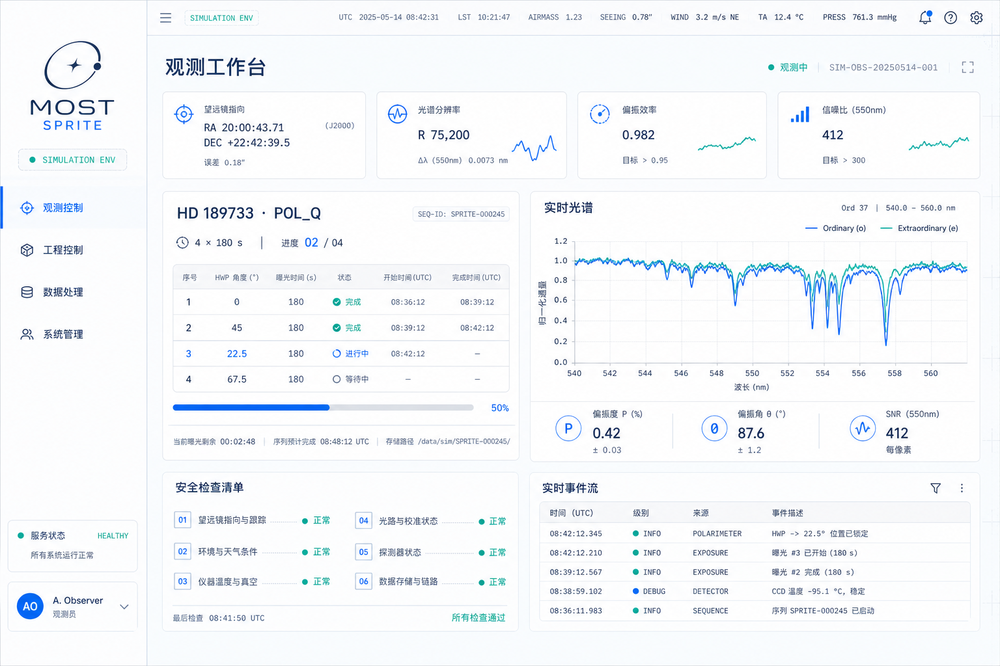
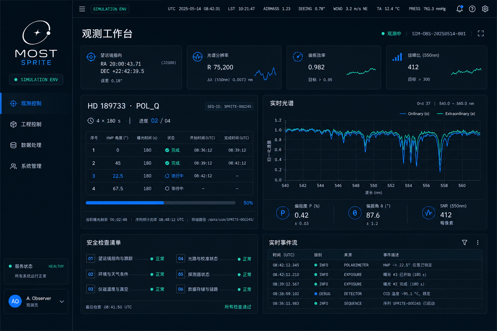
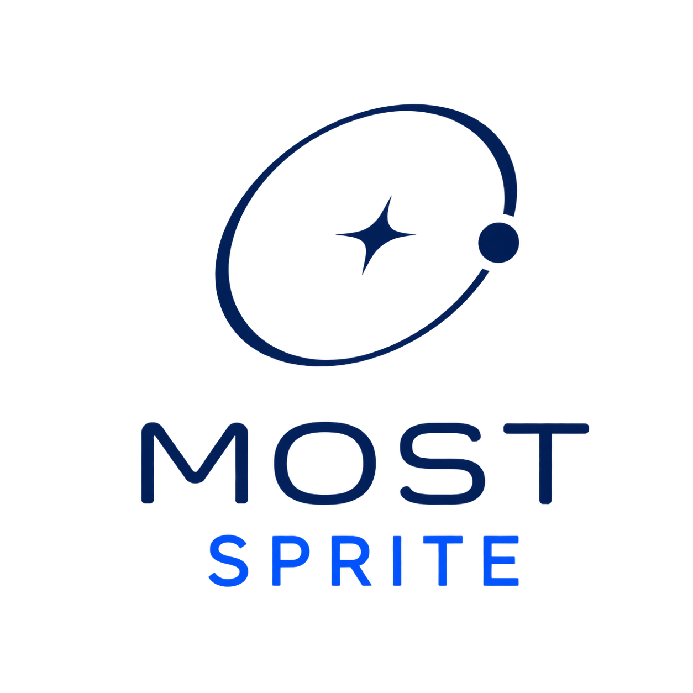

# MOST-SPRITE 前端 UI 设计规范

> 文档状态：设计基线 v0.2  
> 适用范围：`/observe`、`/engineering`、`/data`、`/admin`  
> 设计关键词：简洁、精密、浅色/深色双主题、克制的科幻感  
> 本文定义目标视觉与交互语言，不用于描述当前前端代码的实现状态。

## 1. 设计目标

MOST-SPRITE 是面向天文观测、仪器工程和科学数据处理的专业工作台。界面首先要帮助使用者快速判断设备是否安全、序列是否完整、数据是否可信，其次才是营造科技感。

设计需满足以下原则：

1. **科学数据优先**：目标、模式、曝光进度、时间、坐标、设备反馈和 QC 结论必须处于清晰的信息层级中。
2. **状态明确**：状态不能只靠颜色表达，同时使用文字、图标和必要的原因说明。
3. **昼夜环境一致**：浅色主题适合日间准备、数据处理与普通办公环境；深色主题适合夜间观测与低照度控制室。两种主题保持相同的信息架构与状态语义。
4. **科幻但不赛博朋克**：科技感来自精密网格、等宽遥测数字、细分隔线和严格对齐，不使用纯黑背景、霓虹光晕或夸张渐变。
5. **安全边界可见**：模拟环境、陈旧数据、联锁状态、不可逆操作和 `SIMULATION_ONLY` 必须持续可见。
6. **控制面与数据面分离**：观测页与工程页用于控制和诊断；数据页用于处理、QC 与血缘；数据处理失败不得在视觉上伪装成仪器故障。

## 2. 视觉样例

### 2.1 浅色方案



浅色方案使用灰白画布、白色面板、深海军蓝文字，以及钴蓝和光谱青强调色。适用于观测准备、工程维护、数据处理和普通照明环境。

### 2.2 深色方案



深色方案使用低亮度蓝黑画布和分层蓝灰面板，降低夜间观测环境中的屏幕眩光。它不是浅色页面的简单反色，文字、分隔线、状态色和图表系列均需使用独立 Token。

两张样例图共同用于确定视觉方向、页面密度与组件关系。图中的观测目标、时间、环境数据和序列编号均为演示数据，不应作为真实业务默认值。

## 3. 品牌标识

### 3.1 浅色背景版本



深海军蓝图形与 `MOST` 字标搭配钴蓝 `SPRITE`，用于白色、浅灰和低饱和浅蓝背景。

### 3.2 深色背景版本


冰蓝白图形与 `MOST` 字标搭配光谱青 `SPRITE`，用于 `#071018` 至 `#152938` 范围内的深色背景。

项目 Logo 由椭圆轨道、中心星芒、轨道节点和 `MOST / SPRITE` 字标组成，表达观测目标、仪器轨迹与科学数据处理之间的联系。

### 3.3 使用规则

- 默认使用竖向组合版本，不改变图形与字标的相对比例。
- Logo 四周至少保留一个轨道节点直径的安全空间。
- 桌面侧栏推荐显示宽度为 `112–144 px`；紧凑导航可只使用上方图形标志。
- 根据背景明度选择对应版本；禁止通过 CSS 亮度滤镜临时反转 Logo。
- 不添加阴影、描边、渐变、发光、旋转或立体效果。
- 不单独改变 `MOST` 或 `SPRITE` 的颜色。

品牌资产路径：

```text
frontend/public/brand/most-sprite-logo.png
frontend/public/brand/most-sprite-logo-dark.png
```

## 4. 色彩系统

### 4.1 浅色主题

| Token | 色值 | 用途 |
| --- | --- | --- |
| `canvas` | `#F3F7FA` | 应用背景、页面底色 |
| `sidebar` | `#FAFCFD` | 固定侧栏 |
| `surface` | `#FFFFFF` | 面板、卡片、弹层 |
| `surface-elevated` | `#FFFFFF` | 强调面板、悬浮层、选中区域 |
| `surface-subtle` | `#F8FAFC` | 表头、次级分区、只读区域 |
| `ink` | `#10243A` | 一级文字、核心数值 |
| `text-secondary` | `#718094` | 说明文字、字段标签 |
| `text-muted` | `#97A4B2` | 时间戳、辅助信息、禁用提示 |
| `border` | `#DCE5EC` | 默认边框与分隔线 |
| `border-soft` | `#E9EFF3` | 面板内部弱分隔线 |

### 4.2 深色主题

| Token | 色值 | 用途 |
| --- | --- | --- |
| `canvas` | `#071018` | 应用背景、主画布 |
| `sidebar` | `#050E15` | 固定侧栏 |
| `surface` | `#0B1721` | 面板、卡片、弹层 |
| `surface-elevated` | `#101F2B` | 强调面板、悬浮层、选中区域 |
| `surface-subtle` | `#152938` | 表头、次级分区、只读区域 |
| `ink` | `#E9F1F6` | 一级文字、核心数值 |
| `text-secondary` | `#8299A8` | 说明文字、字段标签 |
| `text-muted` | `#617887` | 时间戳、辅助信息、禁用提示 |
| `border` | `#203545` | 默认边框与分隔线 |
| `border-soft` | `#172A38` | 面板内部弱分隔线 |

深色画布不得使用纯黑色。相邻面板通过明度和边框共同区分，不能仅依赖阴影。

### 4.3 品牌与状态颜色

| Token | 浅色主题 | 深色主题 | 用途 |
| --- | --- | --- | --- |
| `primary` | `#1765D8` | `#3478F6` | 主操作、选中态、主光谱线 |
| `spectral-teal` | `#0AA5A0` | `#65D2FF` | 在线、实时、第二光束、数据新鲜 |
| `success` | `#2E948B` | `#5ED6A7` | 已提交、通过、到位 |
| `warning` | `#C88732` | `#FFB45F` | 需要关注、数据陈旧、模拟限制 |
| `danger` | `#D95C5C` | `#FF6B6B` | 严重报警、失败、危险操作 |
| `violet` | `#7565B2` | `#C48CFF` | 可选的派生数据系列，不作为主操作色 |

### 4.4 使用约束

- 单个页面的强调色以蓝色和青色为主，紫色仅用于区分额外数据系列。
- 大面积背景不使用高饱和颜色。
- 成功状态使用青绿色而非纯绿色，以保持整体冷色调一致。
- 警告和危险色只用于真实语义，不用于装饰或普通图表系列。
- 正文与背景需达到 WCAG 2.2 AA 对比度；小号遥测文字不得低于 `4.5:1`。
- 深色主题中的状态色只允许轻微光晕，光晕不能承担唯一的信息表达。

推荐的设计 Token：

```css
:root {
  --color-canvas: #f3f7fa;
  --color-sidebar: #fafcfd;
  --color-surface: #ffffff;
  --color-surface-elevated: #ffffff;
  --color-surface-subtle: #f8fafc;
  --color-ink: #10243a;
  --color-text-secondary: #718094;
  --color-text-muted: #97a4b2;
  --color-border: #dce5ec;
  --color-border-soft: #e9eff3;
  --color-primary: #1765d8;
  --color-spectral-teal: #0aa5a0;
  --color-success: #2e948b;
  --color-warning: #c88732;
  --color-danger: #d95c5c;
}

[data-theme="dark"] {
  color-scheme: dark;
  --color-canvas: #071018;
  --color-sidebar: #050e15;
  --color-surface: #0b1721;
  --color-surface-elevated: #101f2b;
  --color-surface-subtle: #152938;
  --color-ink: #e9f1f6;
  --color-text-secondary: #8299a8;
  --color-text-muted: #617887;
  --color-border: #203545;
  --color-border-soft: #172a38;
  --color-primary: #3478f6;
  --color-spectral-teal: #65d2ff;
  --color-success: #5ed6a7;
  --color-warning: #ffb45f;
  --color-danger: #ff6b6b;
}
```

### 4.5 主题选择与切换

- 首次访问可参考系统 `prefers-color-scheme`，但必须允许用户手动选择浅色或深色。
- 用户选择保存在本地偏好中，不属于权威业务数据。
- 活动序列运行期间不得根据日落时间或系统设置自动切换主题，避免画面突变影响操作。
- 浅色与深色主题使用同一 DOM 结构、同一组件尺寸和同一状态名称。
- 图表数据系列的语义映射保持一致，只调整为适合对应背景的亮度。
- 切换主题时同步切换 Logo 资源，不使用 `filter: invert()` 或亮度滤镜。
- 主题切换动画控制在 `120–160 ms`；图表、热图和报警不使用交叉淡化，以避免暂时隐藏数据。

## 5. 字体与数字

### 5.1 字体组合

- 界面字体：`Inter`, `Noto Sans SC`, `PingFang SC`, system-ui, sans-serif。
- 遥测字体：`IBM Plex Mono`, `SFMono-Regular`, Consolas, monospace。
- 中文标题使用界面字体，不使用装饰性未来字体。
- UTC、坐标、角度、温度、序列 ID、哈希值和文件编号使用等宽字体。

### 5.2 字号层级

| 层级 | 推荐字号 | 用途 |
| --- | --- | --- |
| 页面标题 | `30–36 px` | 工作区名称 |
| 面板标题 | `16–18 px` | 主要内容分区 |
| 关键遥测值 | `18–26 px` | 进度、S/N、温度、空间 |
| 正文 | `13–14 px` | 描述、表格正文 |
| 标签 | `11–12 px` | 字段名、状态说明 |
| 微型遥测 | `9–10 px` | 英文 eyebrow、时间戳、单位 |

正文最小字号为 `12 px`。只有非关键、可重复获得的遥测标签可使用 `9–10 px`。

### 5.3 数字规则

- 小数位数应由数据类型固定，避免同一列发生跳动。
- 数值与单位之间保留一个空格，例如 `180 s`、`−104.8 °C`。
- 角度统一显示度数符号，例如 `45.0°`。
- 坐标、时间和序列编号禁止自动换行。
- 不以文件名推断业务身份；界面应直接显示 `sequence_id`、`group_id` 或 `exposure_id`。

## 6. 页面骨架

桌面端采用固定侧栏、顶部状态栏和自适应主内容区。

```text
┌──────────────┬───────────────────────────────────────────────┐
│ Logo / 环境  │ 顶部状态栏：UTC、天气、通知、当前用户          │
│              ├───────────────────────────────────────────────┤
│ 主导航       │ 页面标题、状态摘要、主要操作                  │
│              │                                               │
│              │ 状态卡片 / 主工作区 / 快视 / 安全与事件       │
│              │                                               │
│ 服务 / 用户  │                                               │
└──────────────┴───────────────────────────────────────────────┘
```

### 6.1 尺寸基线

| 项目 | 桌面端基线 |
| --- | --- |
| 固定侧栏 | `224 px` |
| 顶部状态栏 | `56–64 px` |
| 内容最大宽度 | `1500 px` |
| 页面水平留白 | `32 px` |
| 面板间距 | `12–16 px` |
| 面板内边距 | `20–24 px` |
| 面板圆角 | `10–12 px` |
| 控件圆角 | `6–8 px` |
| 默认边框 | `1 px` |

页面布局使用 `8 px` 基础网格。组件内部可以使用 `4 px` 半步，但不得出现无规律的间距值。

## 7. 信息架构

| 路由 | 中文名称 | 主要角色 | 核心任务 |
| --- | --- | --- | --- |
| `/observe` | 观测控制 | 观测人员 | 目标与模板、预检、序列控制、曝光进度、导星、快视、报警 |
| `/engineering` | 工程控制 | 仪器工程人员 | 设备诊断、受控动作、到位反馈、环境与联锁 |
| `/data` | 数据处理 | 数据处理人员 | 序列浏览、L0–L3/L4 产品、快视、QC、重处理、血缘 |
| `/admin` | 系统管理 | 系统管理员 | 身份角色、配置审批、服务健康、审计与备份 |

四个工作区共享同一应用壳，但不同工作区不得混入越权操作。例如数据页面不提供任何设备控制按钮，观测页面不得修改限位和安全联锁。

## 8. 观测工作台

观测页是首要设计对象，第一屏必须回答以下问题：

1. 当前目标和观测模式是什么？
2. 仪器与导星是否处于安全、可用状态？
3. 当前序列进行到哪一步？
4. 最新曝光是否完成了不可变 L0 提交？
5. 快视是否支持继续观测？
6. 是否存在需要人工确认的报警？

### 8.1 页面组成

1. **页面标题区**：`观测工作台`、实时状态、当前序列编号、主要操作。
2. **状态摘要卡**：仪器状态、导星状态、CCD 温度、L0 剩余空间。
3. **当前序列**：目标、模式、曝光时间、调制组进度、子曝光列表。
4. **实时光谱/二维快视**：o/e 双光束或目标/天空通道，不混用模式语义。
5. **安全检查清单**：显示通过数量、失败原因和恢复条件。
6. **事件流**：显示时间、来源、事件类型和结果，支持追溯。

### 8.2 偏振模式

- `POL_Q`、`POL_U`、`POL_V` 使用明确的四子曝光结构。
- 子曝光卡显示序号、FR1/FR3 命令值与实测值、o/e 通量、状态和 L0 标识。
- 只有四次子曝光完整且顺序正确时，才展示 P/N1/N2 结果。
- 缺帧、错序、角度超差或 o/e 映射错误时，在组级别显示阻断状态和原因。

### 8.3 NONPOL 模式

- 仅展示目标光纤、天空光纤和停用光纤的映射。
- 展示目标计数、天空计数、`alpha(lambda)` 状态和扣背景结果。
- 不显示调制进度，也不生成 P/N1/N2 的空占位符。

## 9. 工程控制

工程页强调“当前值、目标值、反馈时间、是否到位”四项信息。

- 默认布局采用设备列表与设备详情双栏结构。
- 工程动作仅在 `MAINTENANCE` 状态和授权角色下启用。
- 运动组件同时显示命令值、编码器实测值、限位状态和更新时间。
- 超过新鲜度阈值的数据使用 `STALE` 状态，不继续显示为正常。
- 联锁旁路、恢复和高风险动作使用独立确认流程，并展示影响范围。
- 真实设备控制与模拟设备控制必须在页面顶部和操作按钮附近重复标识。

## 10. 数据处理

数据页采用“序列目录—产品阶梯—科学快视—QC—血缘”的阅读顺序。

- 序列目录支持按夜次、目标、模式和状态筛选。
- 产品阶梯按 `L0 → QUICKLOOK → L1 → L2 → L3 → L4` 横向表达；未实现的层级不显示伪产品。
- 产品卡显示版本、模式、QC 标记、创建时间和不可变标识。
- 偏振产品默认展示 `P`、`N1`、`N2`；NONPOL 产品展示 `TARGET`、`SKY`、`ALPHA`、`I`。
- QC 必须同时展示结论、指标、阈值、实测值和原因码。
- 血缘视图显示输入、配置快照、处理运行、输出和替代关系。
- 重处理必须创建新版本，不提供覆盖旧产品的界面入口。

## 11. 系统管理

- 配置审批、身份角色、服务健康和审计分为独立面板。
- 服务健康同时展示业务状态与数据新鲜度，网络请求成功不等于服务健康。
- 配置状态使用 `UNVERIFIED`、`APPROVED`、`RETIRED` 的明确标签。
- 审计记录为追加写；普通管理员界面不提供删除入口。
- 生产环境未配置 OIDC 时显示阻断页，不降级到开发身份模式。

## 12. 核心组件规范

### 12.1 Panel

- 白色背景、`1 px` 浅灰边框、`10–12 px` 圆角。
- 标题区与内容区使用弱分隔线，不使用大面积色块作为标题背景。
- 标题上方可使用英文等宽 eyebrow，例如 `CURRENT SEQUENCE`。
- 面板阴影仅用于区分层级，透明度应低于 `8%`。

### 12.2 Status Badge

状态徽标包含状态点、文字和可选图标。

| 状态 | 文案示例 | 颜色 | 含义 |
| --- | --- | --- | --- |
| 在线/运行 | `RUNNING`、`LOCKED` | 光谱青 | 正在发生且数据新鲜 |
| 成功 | `COMMITTED`、`PASS` | 成功青绿 | 已完成并通过校验 |
| 等待 | `PENDING`、`STANDBY` | 中性蓝灰 | 正常等待，不是错误 |
| 注意 | `STALE`、`WARNING` | 琥珀色 | 需要关注但未进入危险状态 |
| 失败 | `FAILED`、`SAFE_FAULT` | 红色 | 操作失败或安全阻断 |

徽标不得仅显示无文字的红绿圆点。

### 12.3 Metric Card

- 一张卡只表达一个主要指标。
- 内容顺序为标签、主值、补充信息和新鲜度。
- 主值使用等宽字体；单位字号可降低一级。
- 若数据陈旧，原值可保留，但必须降低强调度并显示 `STALE` 与更新时间。

### 12.4 Progress

- 进度条只用于可量化、可终止的任务。
- 同时显示分子/分母，例如 `02 / 04`，不能只显示百分比。
- L0 进度表示“文件校验并正式提交”，不表示 CCD 已完成读出。
- 暂停与等待状态不使用循环动画伪装进度。

### 12.5 Button

| 类型 | 用途 |
| --- | --- |
| Primary | 当前页面唯一的主要操作，例如“创建并开始序列” |
| Secondary | 暂停、恢复、筛选、查看详情 |
| Danger | 终止、撤回、恢复仪器等高风险操作 |
| Ghost | 面板内低优先级操作 |

同一面板原则上只出现一个 Primary 按钮。危险操作不得使用主蓝色按钮。

### 12.6 Alarm

报警卡必须包含：

- 严重级别；
- 原因码和自然语言原因；
- 自动保护动作；
- 是否已确认；
- 恢复条件；
- 首次发生和最近更新时间。

## 13. 数据可视化

### 13.1 光谱图

- o-beam 使用主蓝色，e-beam 使用光谱青。
- P、N1、N2 使用固定且跨页面一致的颜色。
- 横轴必须标注波长和单位，纵轴标注通量或归一化量。
- 缺失数据以断线表达，不跨越缺口插值。
- 图例不得遮挡数据；鼠标悬停显示波长、数值、误差和 DQ 标记。
- 快视与正式科学产品需要有清晰、持续可见的标签差异。

### 13.2 二维谱图

- 默认采用可感知均匀的单调或顺序色图。
- 饱和像元、坏像元和抽取失败使用独立覆盖层，不混入强度色图。
- 色标必须显示缩放方式、最小值、最大值和单位。
- 禁止使用彩虹色图表达连续强度。

### 13.3 血缘图

- 主要阅读方向固定为从左到右。
- 数据产品、处理运行、配置与 QC 使用不同的节点形态或边框，不只依赖颜色。
- 替代产品与重处理版本使用有向边和明确的版本标签。

## 14. 交互与反馈

- 所有控制按钮只请求状态转换，不直接修改界面中的权威状态。
- 命令提交后显示 `ACCEPTED → EXECUTING → SUCCEEDED/FAILED` 的真实反馈。
- 网络成功但设备未到位时，不提前显示成功。
- 需要较长时间的任务展示当前阶段、进度和可恢复建议。
- 空状态需解释“为什么为空”和“下一步是什么”，不只显示空白面板。
- 错误信息优先展示用户可采取的动作，同时保留原因码和 correlation ID。
- 终止序列、恢复仪器、撤回发布等操作需二次确认；确认内容应说明影响对象。
- 动画时长控制在 `120–220 ms`，仅用于状态过渡和层级反馈。
- 遵守 `prefers-reduced-motion`，数据刷新不使用大面积闪烁。

## 15. 响应式策略

### 15.1 大屏桌面：`≥ 1280 px`

- 显示完整侧栏、顶部遥测和多栏工作区。
- 观测页主区域可使用两栏或三栏布局。
- 适用于实际观测控制和工程操作。

### 15.2 小屏桌面/平板：`768–1279 px`

- 侧栏折叠为 `64–72 px` 图标栏。
- 状态卡由四列改为两列。
- 主工作区按任务优先级纵向堆叠。
- 高风险控制仍需完整确认，不因屏幕变窄而省略说明。

### 15.3 手机：`< 768 px`

- 主要提供状态查看、报警确认和事件浏览。
- 不保证完整二维谱图和复杂工程控制体验。
- 涉及设备运动、序列启动和恢复的操作应提示切换到受支持的桌面终端。

## 16. 可访问性

- 所有交互控件支持键盘操作并显示清晰的 `focus-visible` 样式。
- 图标按钮必须具有可读的 `aria-label`。
- 表格使用真实表头和行列语义。
- 图表提供文本摘要或可访问数据表。
- 状态变化通过可见文字与 `aria-live` 同步表达。
- 颜色不是唯一的信息通道。
- 点击目标最小尺寸为 `40 × 40 px`。
- 正文行高不低于 `1.45`，不使用全大写中文。

## 17. 文案规则

- 中文用于任务、原因和操作；英文用于标准状态、模式、层级和遥测标签。
- 一个概念只使用一个译名，例如统一使用“序列”“子曝光”“产品血缘”。
- 按钮使用动词开头，例如“开始序列”“确认报警”“创建重处理”。
- 避免含糊文案，如“确定”“处理”“操作成功”。
- 时间明确标注 `UTC` 或本地时区。
- 模拟数据始终标注 `SIMULATION ENV` 或 `SIMULATION_ONLY`。

## 18. 验收清单

### 视觉

- [ ] 浅色与深色主题均使用独立 Token，不以整体反色方式生成。
- [ ] 浅色主题无大面积深色背景；深色主题不使用纯黑画布或大面积高亮区域。
- [ ] 蓝色与光谱青是主要强调色。
- [ ] 面板、边框、圆角和间距符合统一 Token。
- [ ] 遥测数字使用等宽字体并保持列对齐。
- [ ] 两种 Logo 的比例、颜色、安全空间和适用背景正确。
- [ ] 主题切换不改变布局、组件尺寸和状态语义。

### 业务表达

- [ ] 偏振与 NONPOL 页面没有混用通道语义。
- [ ] L0 进度以正式提交为完成边界。
- [ ] 设备状态包含实测值、目标值、时间戳和新鲜度。
- [ ] 报警包含原因、保护动作和恢复条件。
- [ ] 数据产品显示模式、版本、QC 和血缘。
- [ ] 模拟边界持续可见。

### 交互与可访问性

- [ ] 加载、空、失败、陈旧和无权限状态均有明确设计。
- [ ] 危险操作具有独立样式和二次确认。
- [ ] 键盘焦点、屏幕阅读器标签和颜色对比度通过检查。
- [ ] 断线和重连不会把旧状态伪装成实时状态。
- [ ] 在桌面、平板和手机断点下没有信息遮挡或横向溢出。

## 19. 关联资料

- 系统架构：[ARCHITECTURE.md](../ARCHITECTURE.md)
- 浅色品牌 Logo：[most-sprite-logo.png](../frontend/public/brand/most-sprite-logo.png)
- 深色品牌 Logo：[most-sprite-logo-dark.png](../frontend/public/brand/most-sprite-logo-dark.png)
- 浅色视觉样例：[most-sprite-ui-concept.png](assets/most-sprite-ui-concept.png)
- 深色视觉样例：[most-sprite-ui-dark-concept.png](assets/most-sprite-ui-dark-concept.png)
- 语言系统实现约定：[frontend-language-system.md](frontend-language-system.md)
